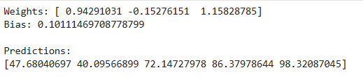

# SGD-Regressor-for-Multivariate-Linear-Regression

## AIM:
To write a program to predict the price of the house and number of occupants in the house with SGD regressor.

## Equipments Required:
1. Hardware – PCs
2. Anaconda – Python 3.7 Installation / Jupyter notebook

## Algorithm
1. Load California housing data, select features and targets, and split into training and testing sets.
2. Scale both X (features) and Y (targets) using StandardScaler.
3. Use SGDRegressor wrapped in MultiOutputRegressor to train on the scaled training data.
4. Predict on test data, inverse transform the results, and calculate the mean squared error.

## Program:

## Developed by: HEMALISHA T
## RegisterNumber: 212225040123

```
import numpy as np

# Input Features
X = np.array([
    [2, 80, 50],
    [3, 60, 40],
    [5, 90, 70],
    [7, 85, 80],
    [9, 95, 90]
], dtype=float)

# Target
y = np.array([50, 45, 70, 80, 95], dtype=float)

# Initialize weights and bias
w = np.zeros(X.shape[1])
b = 0

# Hyperparameters
lr = 0.0001
epochs = 1000

# SGD Training
for epoch in range(epochs):

    for i in range(len(X)):

        # Prediction
        y_pred = np.dot(X[i], w) + b

        # Error
        error = y_pred - y[i]

        # Update weights and bias
        w = w - lr * error * X[i]
        b = b - lr * error

# Final weights
print("Weights:", w)
print("Bias:", b)

# Prediction
predictions = np.dot(X, w) + b

print("\nPredictions:")
print(predictions)
```


## Output:



## Result:
Thus the program to implement the multivariate linear regression model for predicting the price of the house and number of occupants in the house with SGD regressor is written and verified using python programming.
